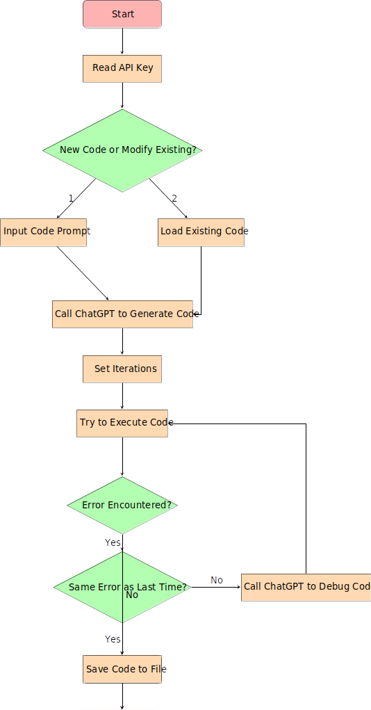

# CatHerder: Reflective LLM Debugger


## Overview

CatHerder is a simple and intuitive debugger that utilizes Large Language Model (LLM) reflection to help you debug Python code effectively. By iteratively refining code with the assistance of an LLM, this tool aims to make the debugging process smoother and more efficient.

## Features

- **Automated Debugging**: Automatically debug Python code using LLM reflections.
- **Iterative Refinement**: Continuously refine the code based on LLM feedback.
- **Error Handling**: Detects and handles repeated errors to avoid infinite loops.
- **User-Friendly**: Allows users to input new code or modify existing code.

## Usage

1. **Clone the Repository**:
    ```bash
    git clone https://github.com/galenwilkerson/CatHerder-reflective-LLM-debugger.git
    cd CatHerder-reflective-LLM-debugger
    ```

2. **Set Up OpenAI API Key**:
    - Save your OpenAI API key in a file named `api_key.txt` in the root directory of the project.

3. **Run the Debugger**:
    - You can run the provided Jupyter notebook or use the script to start debugging your Python code.
    - To run the Jupyter notebook:
      ```bash
      jupyter notebook "Cat Herder - Simple Debugger using LLM Reflection.ipynb"
      ```

4. **Interacting with the Debugger**:
    - The debugger will prompt you to enter a new code prompt or modify existing code.
    - It will then generate initial code, attempt to execute it, and debug iteratively based on the errors encountered.

## Example

Here's a simple example to illustrate how CatHerder works:

1. **Input Code Prompt**:
    ```
    print 'hello world'
    ```

2. **Generated Code**:
    ```python
    print('hello world')
    ```

3. **Execution and Debugging**:
    - If the code fails to execute, CatHerder will provide suggestions to fix the errors.
    - The process will repeat until the code executes successfully or the same error is encountered consecutively, in which case the process stops.
  
## Detailed example
```
Do you want to (1) enter a new code prompt or (2) modify existing code? Enter 1 or 2: 1
Please enter the code prompt: create a fibonacci class
How many debug iterations should be done? 5
------------------
Initial code generated by ChatGPT:
 class Fibonacci:
    def __init__(self, n):
        self.n = n

    def calculate(self):
        fib_sequence = [0, 1]
        for i in range(2, self.n):
            fib_sequence.append(fib_sequence[i-1] + fib_sequence[i-2])
        return fib_sequence[:self.n]

# Example Usage:
n = 10
fibonacci = Fibonacci(n)
result = fibonacci.calculate()
print(result)
------------------

Iteration 1:
[0, 1, 1, 2, 3, 5, 8, 13, 21, 34]
Code executed successfully.
Saved to script.py
Final version saved to script.py


```

## Contributing

Contributions are welcome! Feel free to submit issues or pull requests to enhance the functionality of CatHerder.

## License

This project is licensed under the MIT License. See the [LICENSE](LICENSE) file for details.

## Flow Chart



